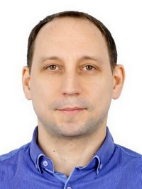

# **Кангер Дмитрий Владимирович**
Мужчина, 43 года, родился 15 июля 1979

+7 (918) 0968042

dmitrykanger@yandex.ru — предпочитаемый способ связи

Проживает: Курганинск

Гражданство: Россия

Не готов к переезду, не готов к командировкам

### Желаемая должность

**Тестировщик ПО**

Специализации:

— Тестировщик

— Информационная безопасность

— Системный администратор

Занятость: полная занятость

### График работы: **удаленная работа**
***
## **Опыт работы**    20 лет

### _Сентябрь 2010 - Настоящее время_ 

**Государственное автономное учреждение Краснодарского края "Многофункциональный центр предоставления государственных и муниципальных услуг Краснодарского края"**

Курганинск, e-mfc.ru

**_Главный специалист_**

Обслуживание компьютерной техники, информационная безопасность
##

### _Июль 2006 — Январь 2010_
*(3 года 7 месяцев)*

**Управление Пенсионного фонд России в Курганинском районе**

Курганинск

**_Главный специалист группы автоматизации_**

Обслуживание компьютерной техники и информационных баз.
##

### _Октябрь 2002 — Июль 2006_
*(3 года 10 месяцев)*

**Опытно-производственная база Таганрогского государственного радиотехнического университета**

Таганрог

**_Инженер-регулировщик_**

Проверка (тестирование) и регулировка блоков питания для цифровых АТС

***
## **Образование**

### **Высшее**
**2002**
**Таганрогский технологический институт Южного федерального университета**

Таганрог

**_Инженер-радиотехник_**

